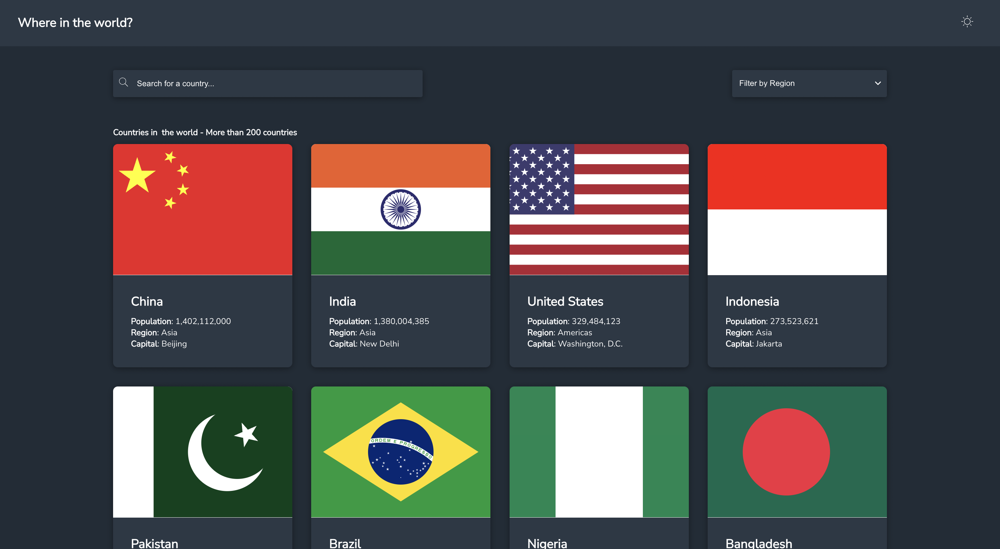

# 🌍 Country Finder

Discover countries around the world ⚡️

<!--  -->

## Table of contents

-   📋 [Process](#process)
-   💻 [Installation](#installation)
-   🚀 [Launch](#launch)

### Process

-   Accessible
-   SEO optimized
-   Mobile-first workflow

### Installation

These instructions will get you a copy of the project on your local machine for development and testing purposes.

Ensure you have the following set up locally:

-   [Node](https://nodejs.org)
-   [Git](https://www.atlassian.com/git/tutorials/install-git)

Clone the repository using any of the methods stated below.

**Via SSH**

```sh
git clone git@github.com:chiamakaikeanyi/country-finder.git
```

**Via HTTPS**

```sh
git clone https://github.com/chiamakaikeanyi/country-finder.git
```

Switch to the directory

```sh
cd country-finder
```

Install the dependencies

```sh
yarn
```

### Launch

Run the command below to start the web app

```sh
yarn start
```

The browser is expected to launch the app on the browser on http://localhost:3000.

<!-- translations, loading skeleton, tests, danger,  workflow, docker, grafana, kubernetes -->
